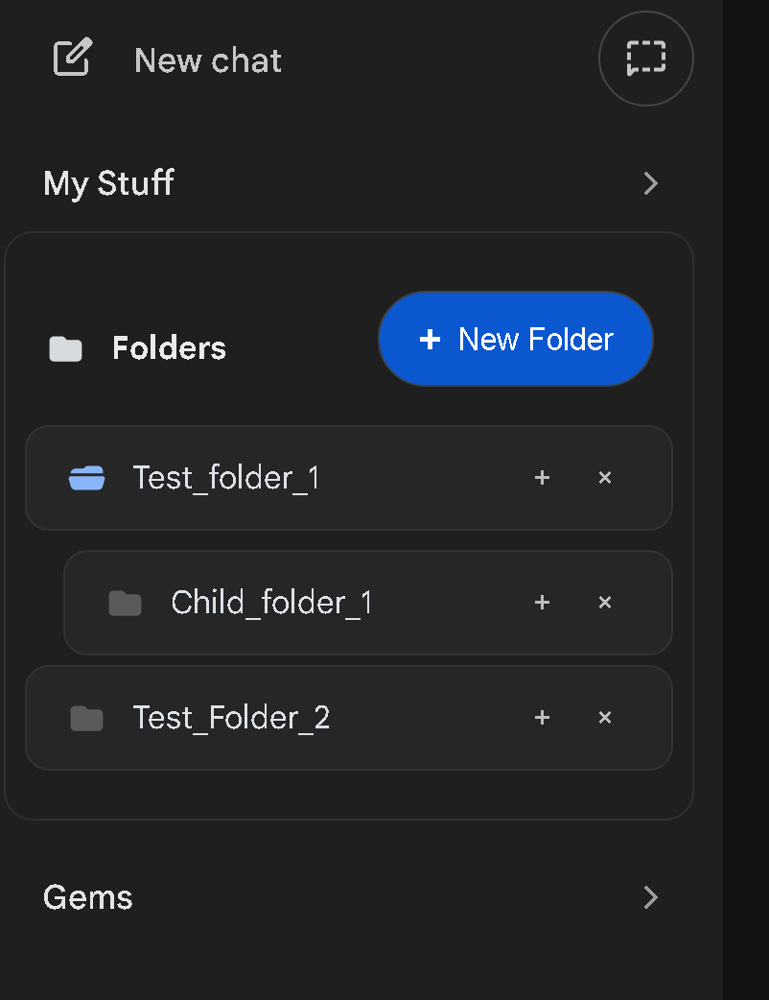
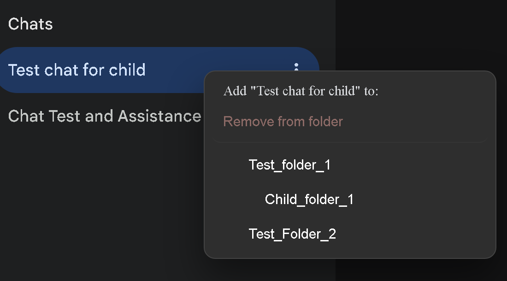
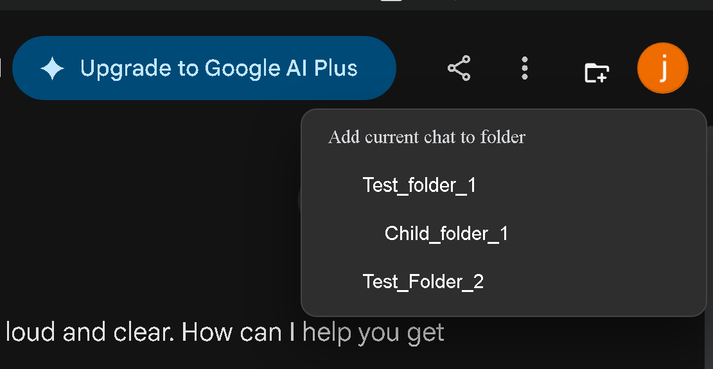
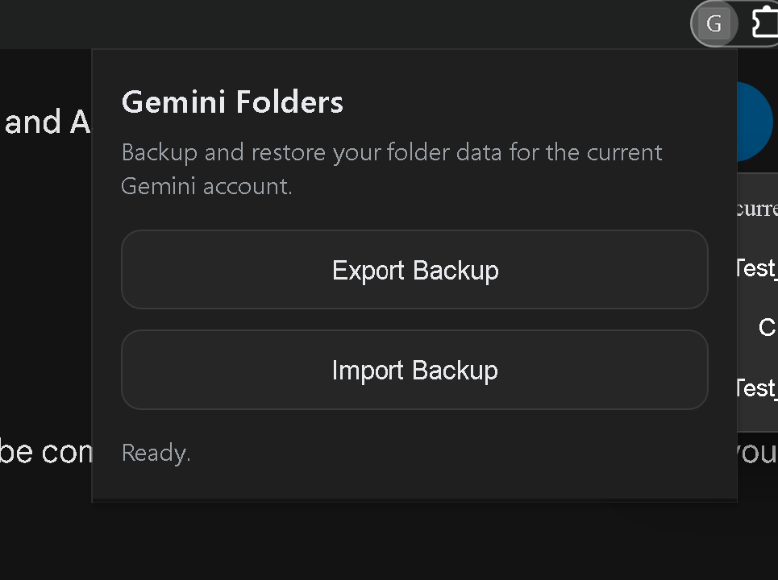

# Gemini Folders Extension

A Manifest V3 Chrome extension that adds a custom folder organizer to the Gemini sidebar.

## What It Adds

- Folder tree in Gemini sidebar
- Nested sub-folders
- Collapse and expand per folder (default is collapsed)
- Assign chats to one or more folders
- Remove chats from folders one folder at a time
- Render assigned chats as clickable sub-items under folders
- Context menu assignment from Gemini chat items (right-click)
- Quick Add button in chat header to add or remove the current chat per folder
- Auto cleanup of chat mappings when folders are deleted
- Selection sync: highlights custom folder chat that matches current URL

## Screenshots

### Folder Sidebar



### Context Menu Assignment



### Quick Add Menu




### Backup and Restore Popup



## Project Structure

This extension is modularized for maintainability and public release:

### Root Files

- **manifest.json**: Extension metadata, permissions, and script loading order
- **.gitignore**: Git ignore patterns for OS junk and IDE settings
- **LICENSE**: MIT license for open-source distribution
- **README.md**: Full documentation and contribution guidelines

### JavaScript Modules (js/ directory)

Loaded in dependency order by manifest.json:

1. **js/utils.js**: Core utilities
   - User ID detection (DOM, WIZ_global_data, profile picture)
   - String hashing and normalization
   - Title extraction and validation
   - Error context checking

2. **js/storage.js**: Storage management
   - Per-user storage key generation
   - Folder state loading/saving
   - Data normalization and migration
   - Chat-to-folder mapping utilities

3. **js/ui-components.js**: UI rendering
   - Folder tree rendering
   - DOM element creation
   - Sidebar injection
   - State synchronization
   - Icon markup generation

4. **js/navigation.js**: Chat navigation
   - Chat URL and title extraction
   - Custom chat item selection
   - Native chat link interaction
   - Current chat context detection

5. **js/main.js**: Entry point and orchestration
   - Global state management
   - MutationObserver setup for sidebar and header
   - Folder CRUD operations (create, delete, organize)
   - Quick Add menu and context menu handling
   - Startup sequence and error handling
   - Message listener for popup refresh

### Styles (styles/ directory)

- **styles/content.css**: All UI styling for sidebar folders and controls

### Popup (backup/ directory)

Directory for export/import popup functionality:

- **backup/popup.html**: Dark-themed popup UI
- **backup/popup.js**: Export/import logic with validation

## Installation (Load Unpacked)

1. Open `chrome://extensions`.
2. Enable Developer mode.
3. Click Load unpacked.
4. Select this folder: `Gemini Folder Extenstion`.
5. Open `https://gemini.google.com/`.

## Permissions

- `storage`: stores folders and chat mappings
- `scripting`: declared in manifest
- Host permission: `https://gemini.google.com/*`

## Data Model (chrome.storage.local)

Storage key: `geminiFolders`

When Gemini exposes a usable account identifier, the extension stores data under a per-user key such as `geminiFolders_<userId>`.

Structure:

```json
{
  "folders": [
    {
      "id": "uuid",
      "name": "Folder Name",
      "children": []
    }
  ],
  "chatToFolderMap": {
    "chatId123": {
      "folderIDs": ["uuid-1", "uuid-2"],
      "title": "Chat Title"
    }
  }
}
```

Notes:

- `folderIDs` is always an array.
- Old single-folder entries are migrated automatically on load.

## How To Use

### Create folders

- Click `New Folder` in the folders block
- Click `+` on a folder row to add a sub-folder

### Collapse and expand

- Click the folder icon on a row, or click the row itself
- Folders are collapsed by default

### Assign chats to folders

Option A (chat page):

- Open a chat page (`/app/<chatId>`)
- Click the Quick Add icon in the chat header
- Choose a folder from the menu
- Folders that already contain the chat show a checkmark and clicking them removes that folder from the chat

Option B (sidebar):

- Right-click a Gemini conversation item
- Choose the target folder
- Right-clicking a custom folder chat item lets you remove that chat from that specific folder

### Remove a chat from a folder

- Right-click the chat in a custom folder chat list
- Choose `Remove from folder`
- In the Quick Add menu, click a checked folder to toggle it off

### Delete folder behavior

- Deleting a folder also deletes its sub-folders
- Any chat mappings that point to deleted folders are removed automatically

## Backup And Restore

Use the extension icon in the browser toolbar to open the popup.

- `Export Backup` downloads a JSON backup for the current Gemini account
- `Import Backup` loads a JSON backup into the current Gemini account and refreshes the sidebar immediately

## Visual Customization

### Folder state icon colors

In `styles/content.css`, inside `#gfo-folders-root.gfo-root`:

- `--gfo-folder-icon-closed-color`
- `--gfo-folder-icon-open-color`

### Quick Add icon color (dark mode)

In `styles/content.css`, edit:

- `#gfo-quick-add.gfo-quick-add { color: ... }`

### Folder list max height

In `styles/content.css`, edit:

- `.gfo-list { max-height: 350px; }`

## Stability and Recovery Notes

- The script guards against extension context invalidation
- MutationObservers are re-created safely
- UI injection is idempotent and checks for existing roots before mounting

## Limitations

- Gemini DOM selectors can change over time
- Header Quick Add injection depends on matching Gemini action group selectors
- Chat title extraction is heuristic-based and falls back when needed

## How to Contribute

We welcome community contributions! Here's how you can help:

### Reporting Issues

If you find a bug or have a feature request:

1. Check existing [GitHub Issues](https://github.com/jayakody/Gemini-Folder-Extenstion/issues) to avoid duplicates
2. Create a new issue with:
   - Clear title and description
   - Steps to reproduce (if applicable)
   - Expected vs. actual behavior
   - Browser version and extension version

### Code Contributions

1. **Fork** the repository
2. **Create a feature branch**: `git checkout -b feature/your-feature-name`
3. **Make your changes**:
   - Keep code modular and focused
   - Follow the existing code style (IIFEs, namespaced functions under `GF`)
   - Remove `console.log` statements before submitting
   - Test on `https://gemini.google.com`
4. **Commit with clear messages**: `git commit -m "Add: descriptive message"`
5. **Push to your branch**: `git push origin feature/your-feature-name`
6. **Create a Pull Request** with description of changes

### Development Setup

```bash
git clone https://github.com/jayakody/Gemini-Folder-Extenstion.git
cd Gemini-Folder-Extenstion
# Load unpacked in chrome://extensions
```

### Testing Your Changes

1. Make changes in the `js/` directory or other source files
2. Reload the extension in `chrome://extensions`
3. Test on `https://gemini.google.com`
4. Verify no console errors (F12 > Console)

### Selector Maintenance

If Gemini's DOM structure changes and selectors break:

1. Update selectors in the relevant `js/` module
2. Add fallback selectors when possible
3. Document the change in your PR with a note about which Gemini version was tested
4. Consider adding a comment explaining the selector's purpose

### Style Guidelines

- Use meaningful variable names
- Group related functions in the same module
- Add comments for complex logic
- Keep functions focused and testable
- Use async/await for Promise-based operations

## Version

Current manifest version: `1.0.0`
